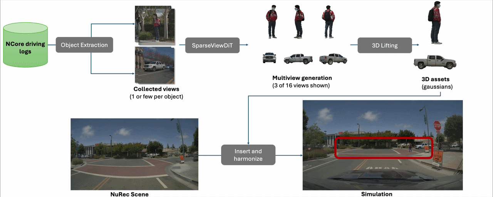

# Asset Harvester: Extracting 3D Assets from Autonomous Driving Logs for Simulation


[](https://research.nvidia.com/labs/sil/projects/asset-harvester/)
[](https://research.nvidia.com/labs/sil/projects/asset-harvester/)
[](LICENSE.txt)
[](https://huggingface.co/nvidia/asset-harvester)[](https://huggingface.co/datasets/nvidia/PhysicalAI-Autonomous-Vehicles-NCore)[](https://huggingface.co/datasets/nvidia/NuRec-AV-Object-Benchmark)

**NVIDIA**


### Abstract

Closed-loop simulation is a core component of autonomous vehicle (AV) development, enabling scalable testing, training, and safety validation before real-world deployment. Neural scene reconstruction converts driving logs into interactive 3D environments for simulation, but it does not produce complete 3D object assets required for agent manipulation and large-viewpoint novel-view synthesis.
To address this challenge, we present Asset Harvester, an image-to-3D model and end-to-end pipeline that converts sparse, in-the-wild object observations from real driving logs into complete, simulation-ready assets.
Rather than relying on a single model component, we developed a system-level design for real-world AV data that combines large-scale curation of object-centric training tuples, geometry-aware preprocessing across heterogeneous sensors, and a robust training recipe that couples sparse-view-conditioned multiview generation with 3D Gaussian lifting. Within this system, SparseViewDiT is explicitly designed to address limited-angle views and other real-world data challenges.
Together with hybrid data curation, augmentation, and self-distillation, this system enables scalable conversion of sparse AV object observations into reusable 3D assets.


<p align="center">
  
</p>

**Asset Harvester** turns real-world driving logs into complete, simulation-ready 3D assets — from just one or a few in-the-wild object views. It handles vehicles, pedestrians, riders, and other road objects, even under heavy occlusion, noisy calibration, and extreme viewpoint bias. A multiview diffusion model generates consistent novel viewpoints, and a feed-forward Gaussian reconstructor lifts them to full 3D in seconds. The result: high-fidelity 3D Gaussian splat assets ready for insertion into simulation environments. The pipeline plugs directly into NVIDIA NCore and NuRec for scalable data ingestion and closed-loop simulation.

## Pipeline Overview

NCore V4 Data ─► NCore Parsing ─► Multiview Diffusion + Gaussian Lifting ─► [`metadata.yaml`](docs/end_to_end_example.md#step-3-generate-external-assets-metadata-to-use-with-nvidia-omniverse-nurec-optional) (required for NuRec Object Insertion)

<table>
  <tr>
    <th>Input View</th>
    <th>Multiview Diffusion (2 of 16 views shown) </th>
    <th>3D Gaussian Lifting </th>
  </tr>
  <tr>
    <td></td>
    <td></td>
    <td></td>
  </tr>
  <tr>
    <td></td>
    <td></td>
    <td></td>
  </tr>
</table>

## User Guide

For end-to-end asset harvesting from recorded driving sessions, see our  <b>[Full End-to-End Workflow](docs/end_to_end_example.md)</b> :sparkles: !

<details>
<summary><b>Setup</b></summary>

#### Prerequisites

- **conda** (Miniconda or Miniforge)
- **NVIDIA driver** >= 570 (CUDA 12.8 compatible)
- **GCC** 10–13 (tested with GCC 12.3)
- **GPU VRAM** ~16 GB (add `--offload` to offload unused models to CPU for lower VRAM)

> **Note:** Initial setup takes ~20 minutes to complete.

```bash
git clone https://github.com/NVIDIA/asset-harvester.git
cd asset-harvester
bash setup.sh
conda activate asset-harvester
```

Options: `bash setup.sh --env-name asset-harvester --python 3.10`

#### Download Model Checkpoints

```bash
pip install huggingface_hub[cli]
hf auth login
hf download nvidia/asset-harvester --local-dir checkpoints
```
or, manually from the [Hugging Face](https://huggingface.co/nvidia/asset-harvester).
This places the following files in `checkpoints/`:

```
checkpoints/
├── AH_multiview_diffusion.safetensors
├── AH_tokengs_lifting.safetensors
├── AH_camera_estimator.safetensors
└── AH_object_seg_jit.pt
```

</details>

<details>
<summary><b>Image-to-3D</b></summary>

Try Asset Harvester on our sample data (Multiview Diffusion + Gaussian Lifting).
Requires ~16GB VRAM. If you run into VRAM OOM issues, add `--offload_model_to_cpu` to offload unused model components to CPU:

```bash
export DATA_ROOT=data_samples/rectified_AV_objects/
export CHECKPOINT_MV=checkpoints/AH_multiview_diffusion.safetensors
export CHECKPOINT_GS=checkpoints/AH_tokengs_lifting.safetensors
export OUTPUT_DIR=outputs/harvesting
python3 run_inference.py \
    --diffusion_checkpoint "${CHECKPOINT_MV}" \
    --data_root "${DATA_ROOT}" \
    --output_dir "${OUTPUT_DIR}" \
    --lifting_checkpoint "${CHECKPOINT_GS}"
```

Or if you have a single-view image with an object in the center and a foreground mask, resize them into 512x512, and place them in a folder with this structure:

```
YOUR_IMAGE_ROOT/
├─── YOUR_IMAGE_NAME_0
│    ├── frame.jpeg
│    └── mask.png
└─── YOUR_IMAGE_NAME_1
...
```

If masks are not available, you can also use our image segmentation model to
 get mask.png from frame.jpeg stored in above structure:

```bash
export CHECKPOINT_SEG=checkpoints/AH_object_seg_jit.pt
export IMAGE_ROOT=data_samples/segmented_images 
python utils/image_segment.py \
  --checkpoint $CHECKPOINT_SEG \
  --image_folder $IMAGE_ROOT \
  --frame_name frame.jpeg \
  --mask_name mask.png
```

Check the folder `data_samples/OOD_images` for example.

After data preparation, run Asset Harvester with our built-in camera estimator:

```bash
export YOUR_IMAGE_ROOT=data_samples/OOD_images
export CHECKPOINT_MV=checkpoints/AH_multiview_diffusion.safetensors
export CHECKPOINT_GS=checkpoints/AH_tokengs_lifting.safetensors
export CHECKPOINT_CAM=checkpoints/AH_camera_estimator.safetensors
export OUTPUT_DIR=outputs/harvesting_with_camera_estimate
python3 run_inference.py \
    --diffusion_checkpoint "${CHECKPOINT_MV}" \
    --ahc_checkpoint "${CHECKPOINT_CAM}" \
    --image_dir "${YOUR_IMAGE_ROOT}" \
    --output_dir "${OUTPUT_DIR}" \
    --lifting_checkpoint  "${CHECKPOINT_GS}"
```

</details>

<details>
<summary><b>Full End-to-End Workflow</b></summary>

For the complete step-by-step pipeline walkthrough — from raw NCore driving logs through NCore parsing, multiview diffusion, Gaussian lifting, and metadata generation — see the **[End-to-End Guide](docs/end_to_end_example.md)**.

</details>


<details>
<summary><b>Benchmark</b></summary>
Coming soon.
</details>


<details>
<summary><b>Repository Structure</b></summary>

```
asset-harvester/
├── run_inference.py                 # Main inference entry point
├── run.sh                           # Step 2: multiview diffusion + Gaussian lifting wrapper
├── utils/
│   ├── generate_external_assets_metadata.py  # Step 3: metadata.yaml for NuRec asset insertion
│   ├── image_guard.py                        # Optional Llama Guard 3 Vision moderation on inputs
│   └── image_segment.py                      # Object-centric segmentation / masks for frames
├── README.md
├── setup.sh
├── ncore_parser/                    # Step 1: NCore V4 parsing
│   ├── run.sh          
│   ├── pyproject.toml
│   └── src/ncore_parser/            # NCore Data Parser
├── models/
│   ├── multiview_diffusion/         # SparseViewDiT model
│   ├── tokengs/                     # TokenGS (Gaussian lifting)
│   └── camera_estimator/            # Camera pose estimater for object
├── data_samples/                    # Bundled sample data for Quick Start
└── checkpoints/                     # Model weights (download separately)
```

</details>

## License

This project is licensed under the Apache License 2.0. See individual file headers for details.

## Citation

If you find this work useful in your research, please consider citing:

```bibtex
@article{cao2026assetharvester,
  title   = {Asset Harvester: Extracting 3D Assets from Autonomous Driving Logs for Simulation},
  author  = {Cao, Tianshi and Ren, Jiawei and Zhang, Yuxuan and 
             Seo, Jaewoo and Huang, Jiahui and Solanki, Shikhar and 
             Zhang, Haotian and Guo, Mingfei and Turki, Haithem and 
             Li, Mu and Zhu, Yue and Zhang, Sipeng and Gojcic, Zan and 
             Fidler, Sanja and Yin, Kangxue},
  year    = {2026},
}
```

## Disclaimer

Asset Harvester is trained for the AV domain, and the results are not guaranteed in other domains.

AI models generate responses and outputs based on complex algorithms and machine learning techniques, and those responses or outputs may be inaccurate or offensive. By downloading a model, you assume the risk of any harm caused by any response or output of the model. By using this software or model, you are agreeing to the terms and conditions of the license, acceptable use policy, and privacy policy as applicable.


